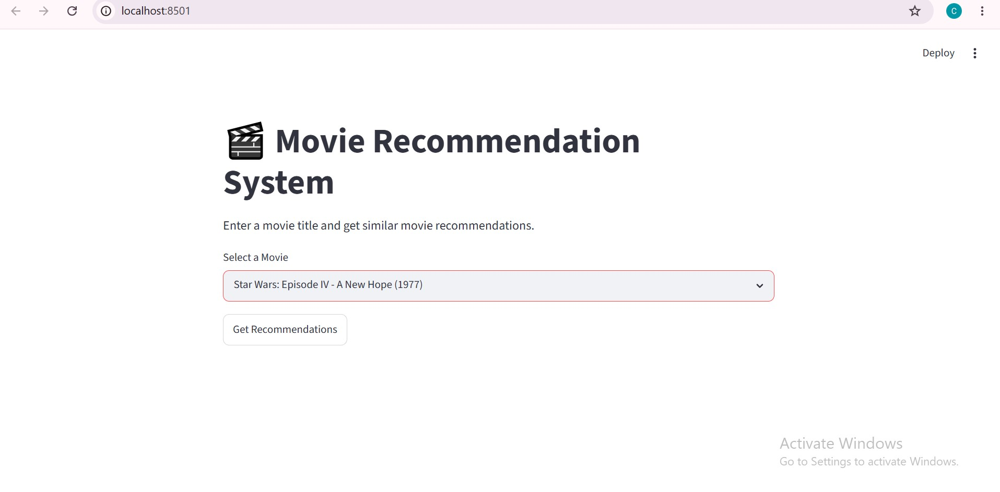
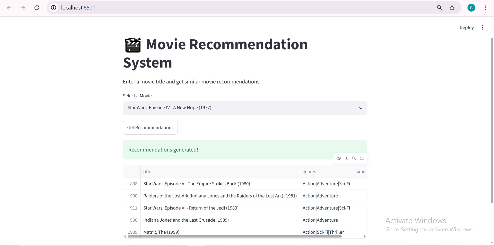

# 🎬 Movie Recommendation System

A movie recommendation web application built using the MovieLens dataset.

The system recommends movies similar to a selected movie using **Item-Based Collaborative Filtering** and **Cosine Similarity**.

---

## Live Demo

🔗 [Try the Application](https://senumi-movie-recommendation-system.streamlit.app)

---

## Project Overview

This project analyzes user movie ratings and builds a recommendation engine that suggests movies similar to a selected movie based on historical user rating behavior.

The application includes:

* Exploratory Data Analysis (EDA)
* Collaborative Filtering Recommendation Model
* Interactive Streamlit Web Application
* GitHub Version Control and Documentation

---

## Technologies Used

* Python
* Pandas
* NumPy
* Scikit-learn
* Matplotlib
* Seaborn
* Streamlit
* Jupyter Notebook
* Git
* GitHub

---

## Dataset

**Dataset:** MovieLens Latest Small Dataset

The dataset contains:

* Movie information
* User ratings
* Movie genres

Main files used:

* `movies.csv`
* `ratings.csv`

Dataset statistics:

* 9,742 movies
* 100,836 ratings
* 610 users

---

## Methodology

### 1. Data Loading

Loaded the MovieLens dataset using Pandas.

### 2. Exploratory Data Analysis (EDA)

Performed analysis on:

* Rating distributions
* Movie popularity
* Most-rated movies
* Dataset quality and missing values

### 3. User-Movie Matrix Creation

Created a matrix where:

* Rows represent users
* Columns represent movies
* Values represent ratings

### 4. Similarity Calculation

Calculated movie-to-movie similarity using:

* Cosine Similarity

### 5. Recommendation Engine

Implemented Item-Based Collaborative Filtering to identify movies with similar rating patterns.

### 6. Web Application

Developed a Streamlit application allowing users to:

* Select a movie from a dropdown menu
* Generate recommendations instantly
* View similarity scores and genres

---

## Features

* Interactive Streamlit interface
* Movie selection dropdown
* Item-based collaborative filtering
* Cosine similarity recommendations
* Similarity score display
* Genre display
* Clean and responsive interface

---

## Application Screenshots

### Home Page



### Recommendations



---

## Project Structure

```text
movie-recommendation-system/
│
├── data/
│   ├── movies.csv
│   └── ratings.csv
│
├── images/
│   ├── homepage.png
│   └── recommendations.png
│
├── notebooks/
│   └── Movie_Recommendation_EDA.ipynb
│
├── src/
│   └── recommender.py
│
├── app.py
├── test_recommender.py
├── requirements.txt
├── README.md
└── .gitignore
```

---

## How to Run the Project

### Clone the Repository

```bash
git clone https://github.com/senumi309/movie-recommendation-system.git
cd movie-recommendation-system
```

### Create and Activate Virtual Environment

```bash
python -m venv .venv
```

Windows:

```bash
.venv\Scripts\activate
```

### Install Dependencies

```bash
pip install -r requirements.txt
```

### Run the Application

```bash
streamlit run app.py
```

---

## Recommendation Approach

This project uses **Item-Based Collaborative Filtering**.

Process:

1. Build a User-Movie Matrix.
2. Calculate Movie Similarities using Cosine Similarity.
3. Identify movies most similar to the selected movie.
4. Return the Top Recommended Movies.

This approach recommends movies based on collective user preferences rather than movie metadata.

---

## Future Improvements

* Add movie posters
* Add movie search and filtering
* Implement content-based filtering
* Hybrid recommendation system
* Optimize model loading with caching
* Add recommendation explanations

---

## Results

Example recommendation generated for:

**Star Wars: Episode IV - A New Hope (1977)**

Top recommendations:

* Star Wars: Episode V - The Empire Strikes Back (1980)
* Star Wars: Episode VI - Return of the Jedi (1983)
* Raiders of the Lost Ark (1981)
* Indiana Jones and the Last Crusade (1989)
* The Matrix (1999)

The recommendation engine successfully identifies movies with similar user rating patterns using Item-Based Collaborative Filtering and Cosine Similarity.


## Learning Outcomes

Through this project I gained practical experience with:

* Data preprocessing
* Exploratory Data Analysis
* Recommendation Systems
* Collaborative Filtering
* Cosine Similarity
* Streamlit Development
* Git and GitHub Workflow
* Project Documentation

---

## Author

**Senumi Weerakoon**

Built as a Machine Learning and Data Science portfolio project.
